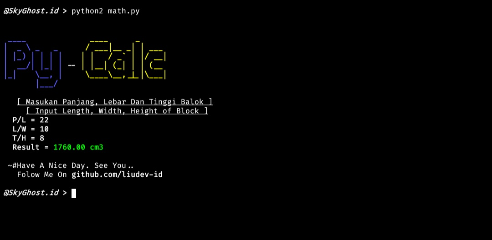

# PyCalc

Simple Math Python Program (To Calculating Block Volume)

# How To Install?
## Linux
- sudo apt install python2
- sudo apt-get install git
- git clone https://github.com/liudev/pycalc
- cd PyCalc
- python2 math.py
## Termux
- pkg install python2
- pkg install git
- git clone https://github.com/liudev/pycalc
- cd PyCalc
- python2 math.py
